# Adapting KiCad Designs for the LPKF ProtoMat E44

Producing a circuit board on the ProtoMat E44 is a little more limited than having a board produced "professionally", there are a number of reasons as listed below

* The tool sizes are limited so there are a smaller amount of tool changes which have to be done manually by the user.
* Milling involves cutting groves in the board, so the bit size limits the dimensions and the risk of burring will destroy micro traces.
* The tolerances are kept to a size where success is more likeley
* Plated Through hole is not available
* Silkscreen and solder mask is not available

The advantage is that once you have your design you can make it yourself within an hour!


Ideally you should design with the design rules in mind from scratch. It is most likely though that when you come to design a board you will use the default KiCAD footprints which do not all fit the limited design rules. So you will probably have to follow this guide.

This guide is to show how to take a KiCad PCB design and make it something the Innovation Lab's
ProtoMat E44 can mill reliably. The guide works through a real example, the
`pic_programmer` demo that ships with KiCad that you should be able to find on every install. We use design rule checks on the stock design and modify it to suit the E44 machine.

There are two ways to do the pad work ([section 3](#3-choose-an-approach-a-or-b)): **A**,
adapt a copy of one design, or **B**, build a reusable E44 footprint library. A is better if you have made the design already and you are bringing it to the machine to test and perhaps might make it elsewhere later. B is better if you are working on a design that is finalised on the E44 machine and it won't go further.

Screenshots are from **KiCad 10.0**. Menu names may differ slightly in older or newer
versions.

> **Status: draft.** Sections marked **TODO** still need checking against how
> the lab runs the machine.

- [1. Why designs need adapting](#1-why-designs-need-adapting)
- [2. The rules at a glance](#2-the-rules-at-a-glance)
- [3. Choose an approach: A or B](#3-choose-an-approach-a-or-b)
- [4. The example: pic_programmer](#4-the-example-pic_programmer)
- [5. Step 1: Add the E44 rules](#5-step-1-add-the-e44-rules)
- [6. Step 2: Set the board defaults](#6-step-2-set-the-board-defaults)
- [7. Step 3: Run DRC to see what needs changing](#7-step-3-run-drc-to-see-what-needs-changing)
- [8. Step 4: What the holes and pads need](#8-step-4-what-the-holes-and-pads-need)
- [9. Step 5, option A: Edit the pads on a copy of the board](#9-step-5-option-a-edit-the-pads-on-a-copy-of-the-board)
- [10. Step 5, option B: Make an E44 footprint library](#10-step-5-option-b-make-an-e44-footprint-library)
- [11. Step 6: Fix tracks, vias, text and pours](#11-step-6-fix-tracks-vias-text-and-pours)
- [12. Step 7: Reroute what no longer fits](#12-step-7-reroute-what-no-longer-fits)
- [13. Step 8: Final DRC](#13-step-8-final-drc)
- [14. Things DRC won't tell you](#14-things-drc-wont-tell-you)
- [15. DRC message reference](#15-drc-message-reference)
- [16. Exporting for CircuitPro](#16-exporting-for-circuitpro)
- [17. Pre-flight checklist](#17-pre-flight-checklist)


Related files:

- [`../e44.kicad_dru`](../e44.kicad_dru): KiCad custom rules
- [`../e44.kicad_jobset`](../e44.kicad_jobset): KiCad jobset that exports the files for CircuitPro
- [`../E44_PCB_Design_Rules_Poster.pdf`](../E44_PCB_Design_Rules_Poster.pdf): one-page summary poster
- [`../examples/pic_programmer_option_A/`](../examples/pic_programmer_option_A/) and [`../examples/pic_programmer_option_B/`](../examples/pic_programmer_option_B/): the example adapted each way

---
## 0. How does the process work?

The design you make will be exported from KiCAD as Gerber files, these are a universal format that is used to manufacture most PCBs in the world. The software that controls the ProtoMat is called CircuitPro and in interprets the Gerber files. Some things we do at this stage are to also please that software, for example unusual shaped holes are converted to outline.

## 1. Why designs need adapting and what a mill is for

A commercial board house such as JLCPCB, Eurocircuits or PCBWAY etches copper chemically and has sophisticated well set up production lines that can hold tracks and gaps
of 0.15 mm or less. The E44 cuts copper away mechanically, it is a CNC mill not an imaging machine. It uses a V-shaped cutter
and mills an isolation channel around every track and pad. This means:

- **Gaps are set by the cutter.** Copper closer together than the width possible with the mill bit can't be separated.
- **Holes come from a fixed set of drills.** A hole size that isn't in the diameter of the drill bits in
  tool rack can't be made.
- **Fine features are fragile.** Thin tracks and small annular rings can tear
  off during milling or when soldering.
- **Holes aren't plated.** A board house plates every hole so the top and
  bottom copper are joined. On the E44 they aren't (see
  [section 14](#14-things-drc-wont-tell-you)).
- **Larger tolerances limit your component choices.** - BGA, TSSOP, MSOP, QFN footprints will not be produceable 
- **More detail takes more time** As the mill has to outline every track, the more complex the design the longer it will take.

KiCad's default libraries and settings assume a board house, so most designs
need some changes before they will mill well. The E44 is rated to 0.1 mm tracks
and 0.15 mm gaps, but these rules are deliberately conservative so boards work
first time.

## 2. The rules at a glance

All dimensions in mm.

| Rule | Value | Notes |
|---|---|---|
| Minimum track width | 0.5 | Set as the net class default |
| Minimum clearance | 0.35 | Copper to copper, including pads within a footprint. 0.3 mm isolation channel + 0.05 mm margin |
| Copper to board edge | 1.0 | From the Edge.Cuts outline to any copper |
| Minimum annular ring | 0.6 | 0.5 allowed on 1.0 mm holes |
| Drill sizes | 0.7, 0.8, 1.0, 1.5, 2.0 | Only these. Any other round hole fails DRC |
| Via | 0.7 hole / 1.9 pad | Set as the net class default |
| 2.54 mm headers | 1.0 hole / 2.0 pad | Leaves a 0.54 mm gap between pads |
| Slot width | 1.0 minimum | Cut with the 1.0 mm router, so inside corners are R0.5 |
| Finest SMD pitch | 0.95 | SOT-23-5 and SOIC are fine. No TSSOP or QFN |

### Tool set

The tool set has been selected to give the best results with minimal tool changes.

| Tool | Size | Used for |
|---|---|---|
| Universal Cutter | 0.2–0.5 | Isolation milling. Isolation width set to 0.3 in CircuitPro |
| End mill | **TODO** confirm: poster says 1.0, `e44.kicad_dru` comment says 2.0 | Copper rubout (clearing large areas) |
| Contour router | 1.0 | Board outline, slots, cutouts |
| Spiral drills | 0.7, 0.8, 1.0, 1.5, 2.0 | All round holes and vias |

## 3. Choose an approach: A or B

Most of the work getting the design to fit the E44 is making the holes and pads fit the E44. There are two ways
to do it. Steps 1–3 and 6–8 are the same for both; only Step 5 differs.

| | **A: Adapt this design as a one-off** | **B: Make an E44 footprint library** |
|---|---|---|
| What you change | The pads on a **copy** of the board | Copies of the footprints, saved in a library |
| Original design | Untouched | Points at the E44 footprints from then on |
| Effort | Less, for one board | More the first time, then none for the same parts |
| Best for | Milling a prototype on the E44, then **sending the same design to a PCB pooling service** (board house) | Designs that will **only ever be made on the E44**, or parts you use again and again |
| Going back to stock footprints | Use the original file, or **Tools → Update Footprints from Library** | Swap the footprints back by hand |

**Choose A** when the E44 board is a quick prototype and the real boards will
come from a board house. Your original design keeps its fine board-house
pads, and the E44 changes live only in a copy you can throw away.

**Choose B** when you only use the machine. You do the pad work once per
part, and every later design that uses the same parts is E44-ready from the
start. It can also be good for coming up with a standard library you can re-sue later.

The example below was done both ways:
[`../examples/pic_programmer_option_A/`](../examples/pic_programmer_option_A/)
and
[`../examples/pic_programmer_option_B/`](../examples/pic_programmer_option_B/).
Both pass DRC.


## 4. The example: pic_programmer

You can work on your own design which is more likely for following this guide, here we will work on a demo project that is shipped with KiCAD.
`pic_programmer` is one of the demo projects installed with KiCad (look in
KiCad's `demos` folder, or **File → Open Demo Project** from the KiCad project
manager). It is a good example of a project that will work well on the mill. It's a two-layer, through-hole board, 
but it was designed for a board house with more drill options and different track spacing limitations.

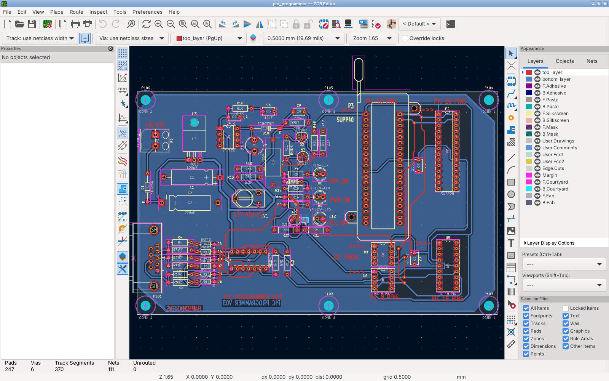

I recommend making a copy before adapting the design, this way you can fall back to your original design
if you want to send it off to a board house.

**File → Save As..** will let you create a renamed copy


## 5. Step 1: Add the E44 rules

1. Open the board in the PCB Editor.
2. **File → Board Setup… → Design Rules → Custom Rules**.
3. Paste the contents of [`e44.kicad_dru`](../e44.kicad_dru).
4. Check the message pane under the editor. It must say **No errors found**.
   The "share the same condition" lines are information only.
5. Click **OK**.

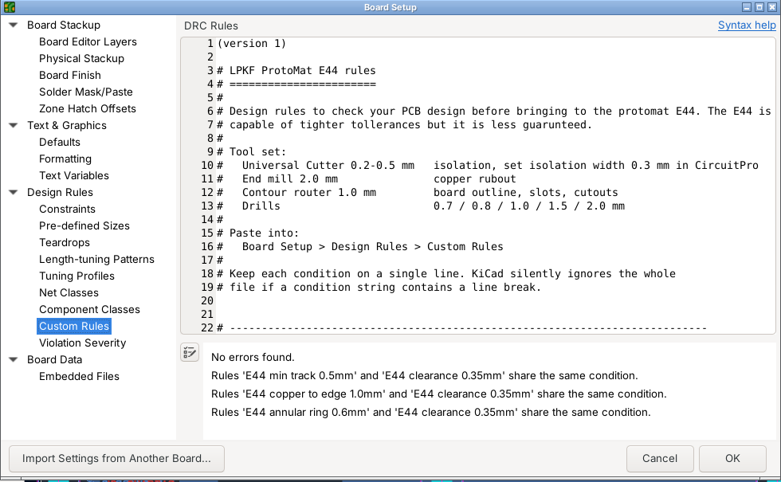

KiCad stores these rules in `<project name>.kicad_dru` next to your
`.kicad_pro` file. Copying `e44.kicad_dru` into your project folder and
renaming it to match the project (here `pic_programmer.kicad_dru`) does the
same thing.

> **Always check the message pane.** If there's an error anywhere in the file,
> KiCad ignores **every** custom rule, and DRC then passes boards it shouldn't.
> An earlier version of `e44.kicad_dru` had line breaks inside its `condition`
> strings, which KiCad can't read:
>
> 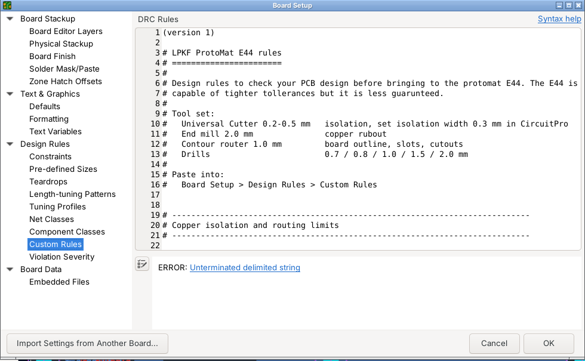
>
> Keep each `condition "..."` on a single line if you edit the rules.

## 6. Step 2: Set the board defaults

The custom rules catch problems when you run DRC but there are other rules than are followed when you lay out a board that gives you visual feedback when routing.
Setting KiCad's defaults to match the custom rules stops you creating those problems while you work. All of these are in
**File → Board Setup…**.

### Constraints

**Design Rules → Constraints**:

| Setting | Value |
|---|---|
| Minimum clearance | 0.35 |
| Minimum track width | 0.5 |
| Minimum annular width | 0.6 |
| Minimum via diameter | 1.9 |
| Copper to edge clearance | 1 |
| Minimum drill size | 0.7 |

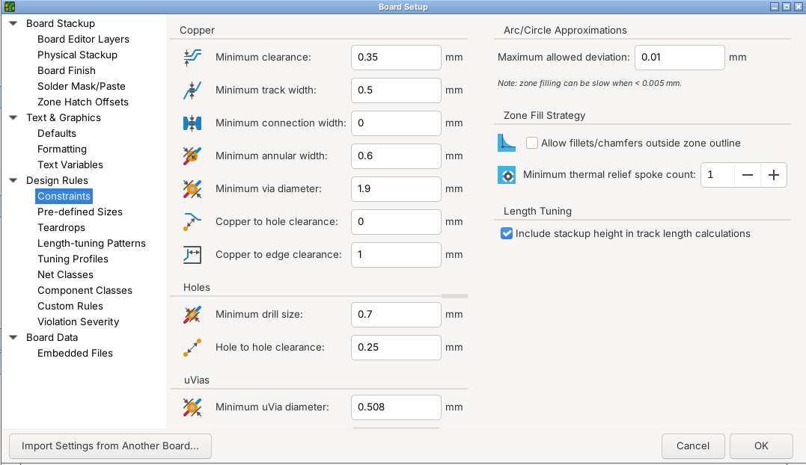

The custom rules take priority over these, which is how 1.0 mm holes are
allowed a 0.5 mm annular ring even though the minimum here is 0.6.

### Net classes

**Design Rules → Net Classes**. Set **every** net class, not just `Default`,
to at least 0.35 clearance, 0.5 track width and a 1.9 / 0.7 via.

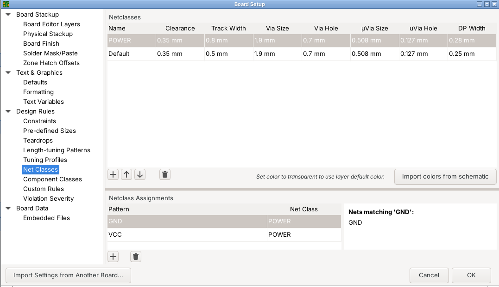

If you are using a design you did not make, make sure that all classes are changed
pic_programmer has a `POWER` class for GND and VCC with 0.8 mm tracks, which
is fine, but its clearance was 0.28 mm, so it had to be raised to 0.35. 

### Pre-defined sizes

**Design Rules → Pre-defined Sizes**. These appear in the track width and via
size drop-downs while routing:

- Tracks: 0.5, 0.8, 1, 1.5
- Vias: 1.9 / 0.7

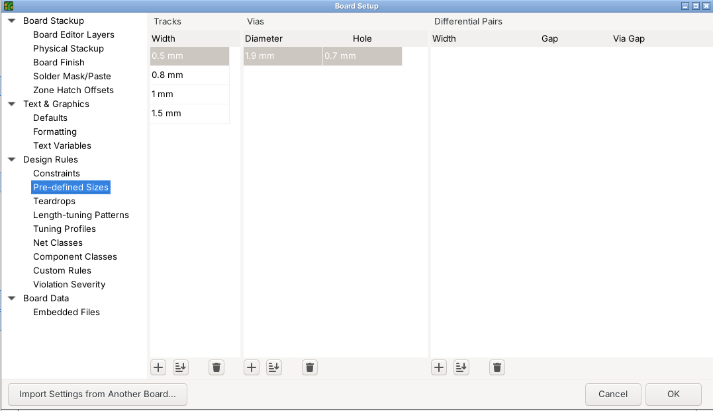

### Violation severity

**Design Rules → Violation Severity**. The E44 makes no solder mask or
silkscreen, so set these to **Ignore**. Otherwise they bury the errors that
matter for the E44 under errors that don't (pic_programmer reports nearly 100 of them):

- Solder mask aperture bridges items with different nets
- Silkscreen clearance
- Silkscreen clipped by solder mask
- Silkscreen clipped by board edge

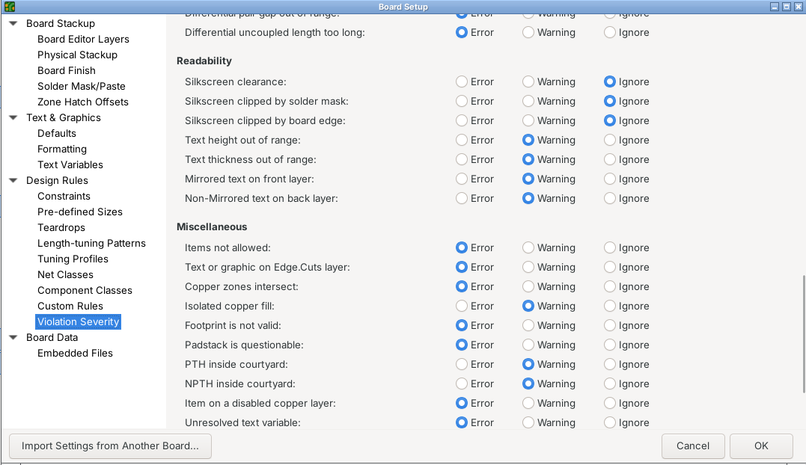

## 7. Step 3: Run DRC to see what needs changing

**Inspect → Design Rules Checker**, then **Run DRC**.

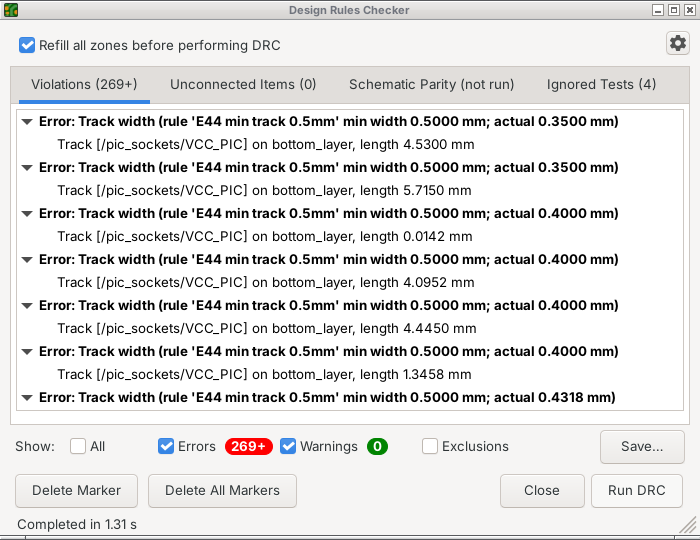

Every red arrow on the board is a problem:

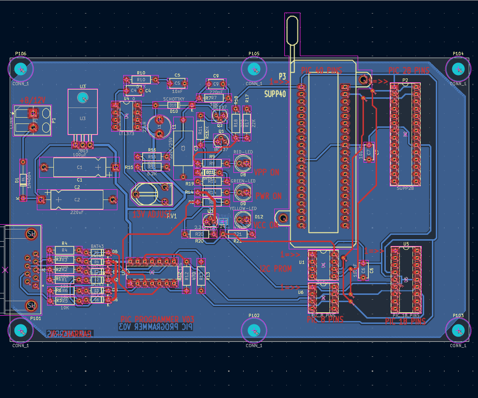

For the stock pic_programmer the errors were:

| Problem | Count | Fixed in |
|---|---|---|
| Annular ring too small | ~200 | [Steps 4–5](#8-step-4-what-the-holes-and-pads-need) |
| Pad hole not in the drill set | 38 | [Steps 4–5](#8-step-4-what-the-holes-and-pads-need) |
| Via hole not in the drill set | 6 | [Step 6](#11-step-6-fix-tracks-vias-text-and-pours) |
| Track narrower than 0.5 mm | 11 | [Step 6](#11-step-6-fix-tracks-vias-text-and-pours) |
| Copper closer than 0.35 mm | 16 | [Step 7](#12-step-7-reroute-what-no-longer-fits) |
| Copper closer than 1.0 mm to the edge | 1 | [Step 6](#11-step-6-fix-tracks-vias-text-and-pours) (zone refill) |

Nearly all of these come from footprints, so start there.

## 8. Step 4: What the holes and pads need

Footprints are where most of the work is. Stock KiCad footprints assume
plated board-house holes and tight pad spacing. This section says what every
hole and pad has to become. The next step does it, using
[option A](#9-step-5-option-a-edit-the-pads-on-a-copy-of-the-board) or
[option B](#10-step-5-option-b-make-an-e44-footprint-library).

### 8.1 Hole sizes

Every round hole must be 0.7, 0.8, 1.0, 1.5 or 2.0 mm. KiCad's hole sizes
already include room for the lead, so round each one to the nearest drill in
the set, going **up** unless the bigger hole no longer fits on the pin pitch.

| Stock KiCad hole | E44 drill | pic_programmer parts |
|---|---|---|
| 0.75 | 0.8 | TO-92 transistors |
| 0.8 | 0.8 | Resistors, diodes, small capacitors, DIP sockets |
| 0.9 | 1.0 | 5 mm LEDs |
| 1.0 | 1.0 | DSUB-9, ZIF socket |
| 1.1 | 1.0 | TO-220 regulator. Rounded **down**: a 1.5 mm hole needs a 2.7 mm pad, which doesn't fit at 2.54 mm pitch. Check the part's lead size against 1.0 mm |
| 1.2, 1.27, 1.3 | 1.5 | Electrolytics, inductor, trimmer, terminal block |
| 2.0 | 2.0 | ZIF socket mounting pegs |
| Over 2.0 | Routed cutout | Mounting holes (see 8.3) |

### 8.2 Pad sizes and annular rings

The annular ring is the copper left around a hole:
`(pad size − hole size) / 2`. It must be at least 0.6 mm, or 0.5 mm on a
1.0 mm hole. That gives these minimum pad sizes:

| Hole | Minimum pad |
|---|---|
| 0.7 | 1.9 |
| 0.8 | 2.0 |
| 1.0 | 2.0 |
| 1.5 | 2.7 |
| 2.0 | 3.2 |

For an oval or rectangular pad only the narrow side has to meet the minimum.

Bigger pads use up the space between them, so check the gap stays at least
0.35 mm. On a 2.54 mm pitch, 2.0 mm pads leave 0.54 mm, which passes, but no
track can fit through.

| pic_programmer footprint | Stock hole / pad | E44 hole / pad |
|---|---|---|
| Resistors, diodes, C_Disc, C_Axial | 0.8 / 1.6 | 0.8 / 2.0 |
| DIP-8/14/18/28 LongPads (ICs and sockets) | 0.8 / 2.4 × 1.6 | 0.8 / 2.4 × 2.0 |
| LED_D5.0mm | 0.9 / 1.8 | 1.0 / 2.0 |
| TO-220-3 (U3) | 1.1 / 1.9 × 2.0 | 1.0 / 2.0 |
| DSUB-9 (J1) | 1.0 / 1.6 | 1.0 / 2.0 |
| 40-pin ZIF socket (P3) | 1.0 / 1.6 × 2.8 | 1.0 / 2.0 × 2.8 |
| ZIF socket pegs | 2.0 / 2.8 | 2.0 / 3.2 |
| CP_Axial (C1, C2) | 1.2 / 2.4 | 1.5 / 2.7 |
| L_Radial (L1) | 1.3 / 2.6 | 1.5 / 2.7 |
| Trimmer (RV1) | 1.27 / 2.03 | 1.5 / 2.7 |
| Terminal block (P1) | 1.3 / 3.0 | 1.5 / 3.0 |

### 8.3 Holes bigger than 2.0 mm

The drills stop at 2.0 mm, but the 1.0 mm contour router cuts anything drawn
on **Edge.Cuts**, including internal cutouts. So for mounting holes and other
large holes:

1. Delete the pad.
2. Draw a circle of the hole's diameter on the **Edge.Cuts** layer in its
   place.

pic_programmer had three kinds: the six M4 mounting holes (4.3 mm), the DSUB
connector's mounting holes (3.2 mm) and the TO-220 tab hole (3.5 mm).

The copper-to-edge rule applies to these cutouts too, so nearby copper must be
at least 1.0 mm away.

### 8.4 Swap footprints that can't be fixed

Some footprints can't meet the rules however you size the pads. The
pic_programmer transistors used a TO-92 footprint with 1.27 mm pin pitch:
2.0 mm pads would overlap. The fix is a different footprint, KiCad's
`TO-92_Wide` (same triangle, 2.54 mm pitch). TO-92 leads bend easily to fit.

The wider footprint is bigger, so when you place it check it doesn't run into
its neighbours. Here the solder jumper next to Q3 had to move 1.27 mm.

### 8.5 Surface-mount parts

The finest pitch that works is 0.95 mm (SOT-23-5). SOIC (1.27 mm) and larger
are fine. TSSOP, MSOP, QFN and similar won't mill: choose a SOIC or
through-hole version, or use a breakout board.

The 0.35 mm clearance applies between pads **inside** a footprint too.
pic_programmer's only SMD part, the solder jumper JP1, has a 0.3 mm gap
between its pads. In the E44 version each pad was moved 0.1 mm outwards to make
it 0.5 mm, which is still easy to bridge with solder.

## 9. Step 5, option A: Edit the pads on a copy of the board

Here you change the pads directly on the board, in groups, without touching
any footprint library. Nothing in this section involves opening pads one at
a time.

### 9.1 Work on a copy

**File → Save As…** and give the board a new name, for example
`pic_programmer_E44.kicad_pcb`. Make every change in the copy. The original
stays as it is, ready to send to a board house.

### 9.2 Open the Drills list

**View → Panels → Search**, then the **Drills** tab. It lists every hole size
on the board and how many there are. Stock pic_programmer has 13 sizes, and
most of them aren't in the E44 drill set:

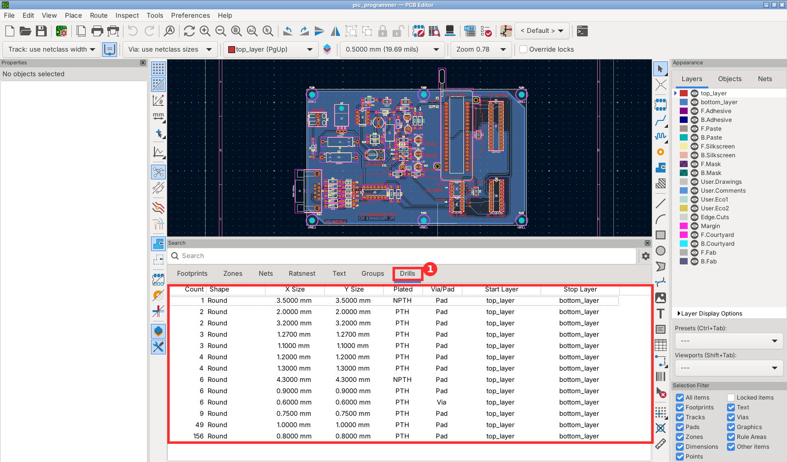

### 9.3 Change many pads at once

It is tedious to change every pad one at a time, ideally changes should be done in groups. Unfortunately KiCAD does not have a tool
to change a paramater on multiple selected pads, but it can copy a pads parameters and push to others. To do this you have to select what you want to change, create the change then push the changes to the pads you want to change.

Clicking a row in the Drills list **selects every pad with that hole size**.
The **Properties** panel on the left then edits all of them together.

For each row, set the hole to a drill from the set and the pad to at least the
minimum size, using the tables in [Step 4](#8-step-4-what-the-holes-and-pads-need):

1. Click the row (here the nine 0.75 mm holes of the TO-92 transistors).
2. Set **Size X** to the minimum pad size (2.0 mm).
3. Set **Hole Size X** to the E44 drill (0.8 mm). Press Enter after each value.

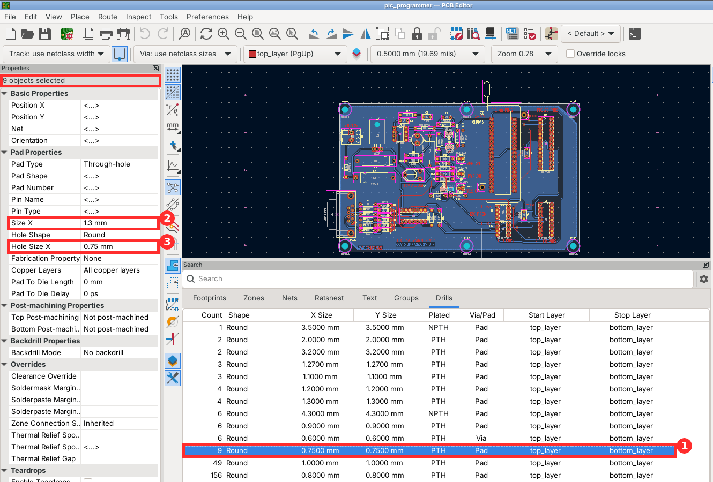

The row disappears into the 0.8 mm row, because those pads now have 0.8 mm
holes:

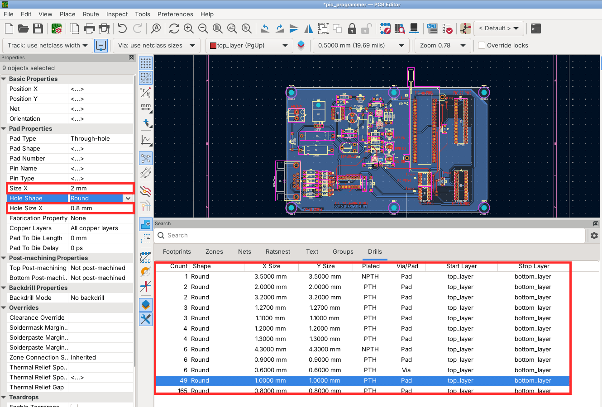

Work down the list. For pic_programmer:

| Drills row | Count | Set Hole Size X | Set Size X |
|---|---|---|---|
| 0.75 mm | 9 | 0.8 | 2.0 |
| 0.9 mm | 6 | 1.0 | 2.0 |
| 1.1 mm | 3 | 1.0 | 2.0 |
| 1.2 mm | 4 | 1.5 | 2.7 |
| 1.27 mm | 3 | 1.5 | 2.7 |
| 1.3 mm | 4 | 1.5 | 2.7 |
| 0.8 mm (now 165 pads) | 165 | (already 0.8) | 2.0 |
| 1.0 mm (now 58 pads) | 58 | (already 1.0) | 2.0 |
| 2.0 mm | 2 | (already 2.0) | 3.2 |
| 0.6 mm **Via** | 6 | Via: **Diameter** 1.9, **Hole** 0.7 | |
| 3.2, 3.5, 4.3 mm | 9 | Too big to drill: see [9.6](#96-holes-bigger-than-20-mm) | |

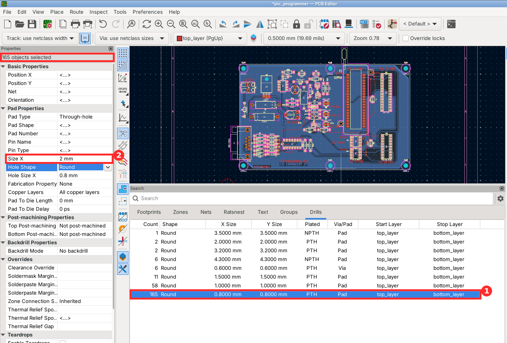

> **Watch the row positions.** If every selected pad is non-round, the panel
> shows an extra **Size Y** row and everything below it moves down one line.
> Check you're typing into the field you mean.

After this, every **round** pad on the board is done. Setting Size X on a
mixed row also changes the X size of the oval pads in it, so pic_programmer's
long 2.4 × 1.6 mm DIP pads become 2.0 × 1.6 mm. That's fine: the next step
fixes their height, and 2.0 × 2.0 mm pads pass the rules.

### 9.4 Fix the non-round pads

We now have to think about annular rings, when we changed the hole size new DRC errors appear because they larger hole brings the outside of the pad closer to the hole.

A Drills row mixes pad shapes. pic_programmer's 0.8 mm row has round resistor
pads, oval DIP pads and square pin-1 pads. When a selection contains round
pads, the Properties panel only shows **Size X**, so the oval and square pads
are still too narrow in Y. Run DRC: the only annular-ring errors left are on
those pads.

To fix them, select only non-round pads, so that **Size Y** appears:

1. In the **Selection Filter** (bottom right), untick **All items** and tick
   only **Pads**.
2. Drag a box around each IC or socket. Hold **Shift** while dragging to add
   more boxes to the selection.
3. If a round pad gets caught in a box, **Ctrl+Shift+click** it to remove it.
   **Size Y** only appears when no round pads are selected.
4. Set **Size Y** (2.0 mm here).

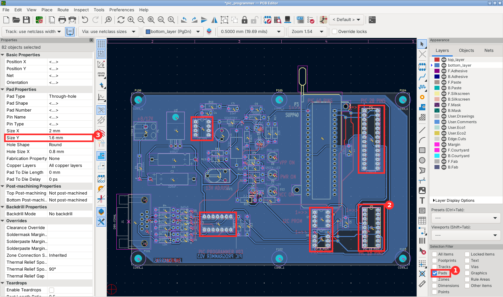

The pads still flagged after that are scattered: mostly square pin-1 pads
on the diodes, LEDs and connector, plus any DIP pad a box missed. Run DRC to
find them, **Shift+click** each one to build a single selection, then set
**Size Y** once:

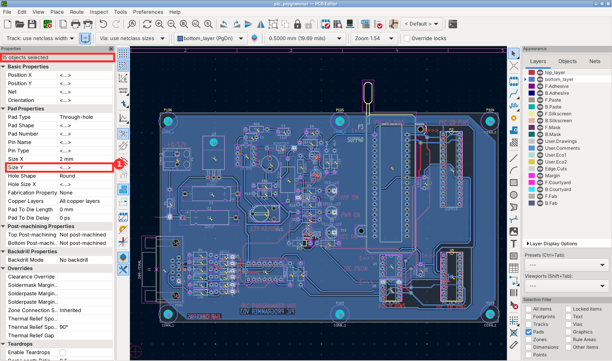

Pads keep their shapes, so pin 1 is still square. Since an E44 board has no
silkscreen, that square is the only pin-1 marker you'll have.

> **Quicker, but loses shapes:** right-click a finished pad → **Copy Pad
> Properties to Default**, then select a Drills row, right-click a selected
> pad → **Paste Default Pad Properties to Selected**. Every pad in the row
> becomes a copy of that pad, **including its shape**, so pin-1 squares and
> long DIP pads all turn into circles. It passes DRC; use it if you don't mind
> losing the pin-1 marks.

### 9.5 Swap footprints that can't be fixed

The TO-92 transistors are 1.27 mm pitch, too tight for 2.0 mm pads
([8.4](#84-swap-footprints-that-cant-be-fixed)). Swap all three at once with
**Edit → Change Footprints…**:

1. Choose **Change footprints with library id** and enter the current one
   (`footprints:TO-92`).
2. In **New footprint library id**, enter `Package_TO_SOT_THT:TO-92_Wide`.
3. Click **Change**.

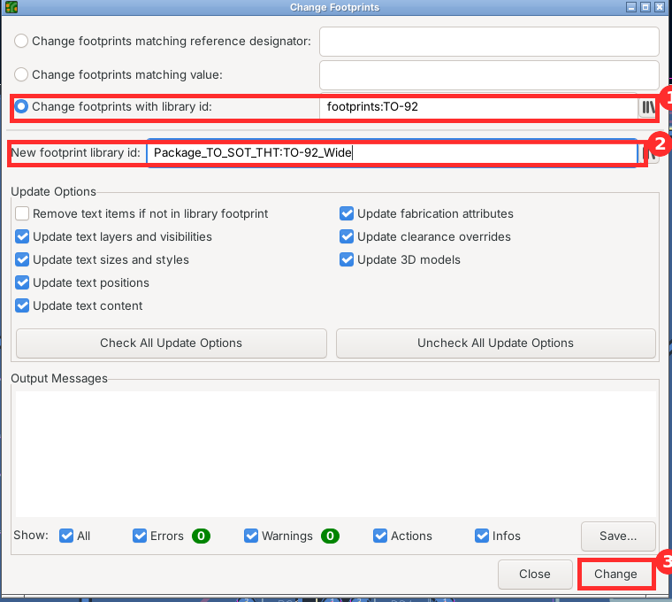

The new footprints come with their stock 1.5 mm pads, so fix them too. For
identical footprints, **Push Pad Properties** is quickest: fix one pad, then
right-click it → **Push Pad Properties to Other Pads…**. Untick **Do not modify
pads having a different orientation** (the three transistors face different
ways), then **Change Pads on Identical Footprints**:

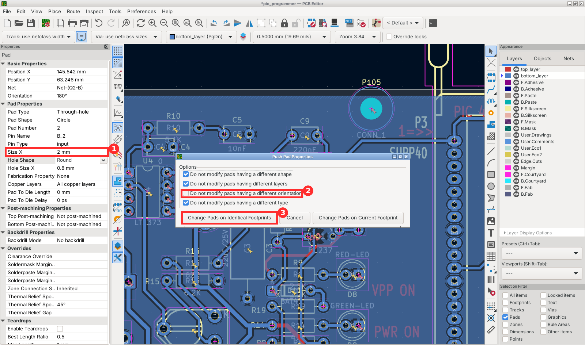

Do the same once for pin 1 (the square pad), setting both Size X and Size Y.

**Change Footprints** keeps pin 1 where it was, so the wider footprint can run
into its neighbours. Press **M** to move each one back to the middle of where
it was. On pic_programmer, Q1 needed moving, and the solder jumper JP1 next
to Q3 had to move 1.27 mm.

The solder jumper JP1 is the board's only SMD part, and its two pads are
0.3 mm apart ([8.5](#85-surface-mount-parts)). Click each pad and add 0.1 mm
to its **Position X** in the Properties panel (one pad left, one right) to
open the gap to 0.5 mm.

> Changing footprints in the board but not the schematic gives a
> "doesn't match footprint given by symbol" note in the parity check. On a
> one-off copy that's expected and harmless.

### 9.6 Holes bigger than 2.0 mm

Mounting holes and similar have to be cut by the router as an **Edge.Cuts**
circle ([8.3](#83-holes-bigger-than-20-mm)). You can do that inside the board
copy without a library:

1. Select the footprint (with **Footprints** ticked in the Selection Filter),
   right-click → **Open in Footprint Editor** (**Ctrl+E**). The banner says
   "Saving will update the board only", so the library is untouched.
2. Switch to the **Edge.Cuts** layer and draw a circle centred on the hole.
   Then select the circle and type the exact **Center X / Y** (from the pad's
   Position) and **Radius** (half the hole size) into the Properties panel.
3. Delete the pad. Tip: in the editor's Selection Filter, tick only **Pads**
   so you don't pick up the overlapping text by mistake.
4. **File → Save** (Ctrl+S) and close the Footprint Editor.

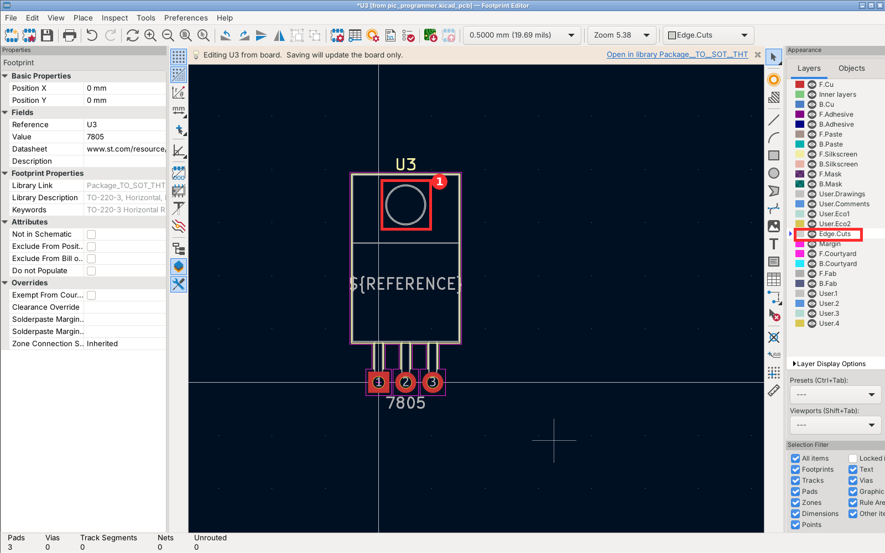

Repeat for each footprint with a big hole. pic_programmer has nine big holes
in eight footprints: the TO-220 tab (U3), the DSUB connector (J1, two holes)
and six M4 mounting holes (P101–P106).

### 9.7 Silence the library warnings

Every pad you changed makes its footprint differ from the library, so DRC
gives a "Footprint … does not match copy in library" **warning** for each. On
a one-off copy that's exactly what you meant. Right-click one →
**Ignore all 'Footprint doesn't match copy in library' violations**:

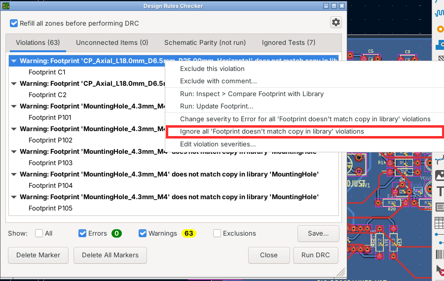

Now carry on with [Step 6](#11-step-6-fix-tracks-vias-text-and-pours): tracks,
vias, text and pours are the same for both approaches.

### 9.8 Going back to the board-house design

- If you worked on a copy (9.1), just open the original. Nothing in it has
  changed.
- If you edited the original by mistake, **Tools → Update Footprints from
  Library…** puts back the stock pads, and **Tools → Update PCB from
  Schematic…** puts back footprints you swapped. Tracks you rerouted for the
  E44 stay as they are, so check them before sending the board off.


## 10. Step 5, option B: Make an E44 footprint library

Here you make E44 versions of each footprint once, in a library, and use them
in every design you mill. It's more work the first time, but the next board
that uses the same parts needs no pad editing at all.

### 10.1 Make a library

Keep E44 copies of footprints in a library of their own:

1. **Preferences → Manage Footprint Libraries… → Project Specific
   Libraries**.
2. Click the folder button and create a new library, for example `E44.pretty`
   in the project folder, with nickname `E44`.

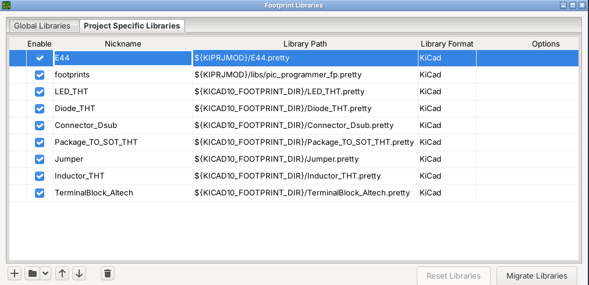

3. Open **Tools → Footprint Editor**, open each stock footprint the board
   uses, and **File → Save As…** into the `E44` library. Adding `_E44` to
   the name makes them easy to tell apart.
4. Edit the copy to the sizes in [Step 4](#8-step-4-what-the-holes-and-pads-need) and save it.

This builds up a reusable set of E44-ready footprints. The 21 made for
pic_programmer are in
[`../examples/pic_programmer_option_B/E44.pretty`](../examples/pic_programmer_option_B/E44.pretty).
**TODO:** decide whether the lab keeps a shared E44 library in this repository.

### 10.2 Edit the footprints

In the Footprint Editor, double-click a pad to open **Pad Properties** and
set **Pad size X / Y** and the hole **Diameter**. The pic_programmer DIP
sockets kept their long 2.4 mm pads and only grew the narrow side:

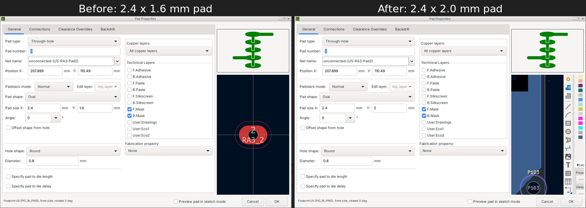

The Properties panel tricks in
[option A](#93-change-many-pads-at-once) also work in the Footprint Editor:
select every pad of the footprint and change them together.

For holes over 2.0 mm, delete the pad and draw an **Edge.Cuts** circle
([8.3](#83-holes-bigger-than-20-mm)):

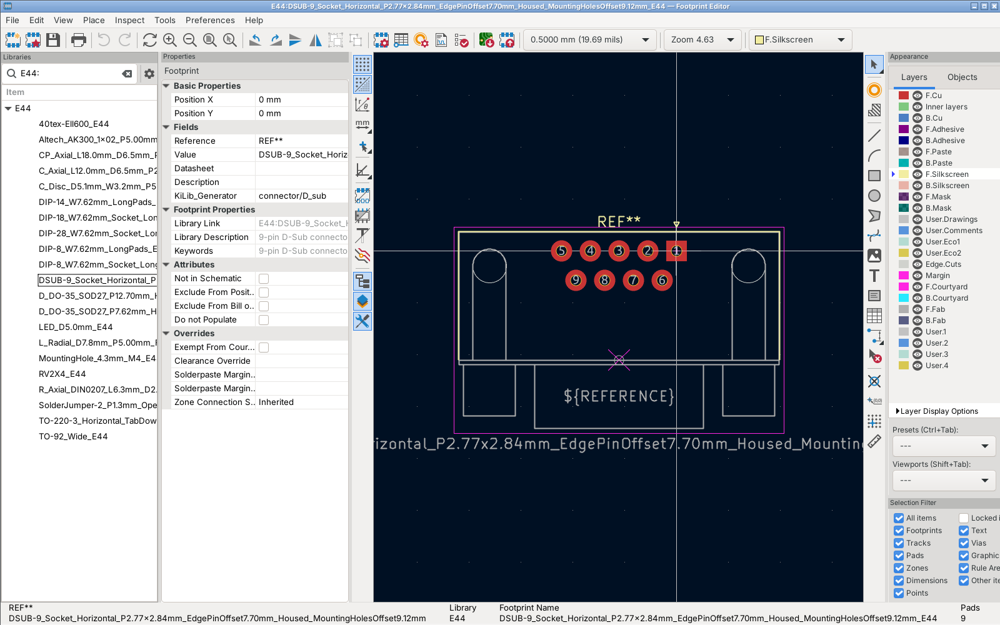

For footprints that can't be fixed ([8.4](#84-swap-footprints-that-cant-be-fixed)),
start from a different stock footprint, such as `TO-92_Wide`:

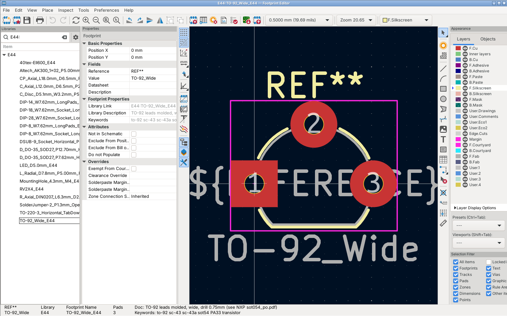

### 10.3 Put the E44 footprints on the board

Once the library is ready:

1. **Edit → Change Footprints…** swaps the footprints on the board for the E44
   versions, keeping position, rotation and connections. Use it once per
   footprint type, or select several parts first.
2. In the **Schematic Editor**, change each symbol's **Footprint** field to
   the `E44:` version as well, otherwise the next **Update PCB from
   Schematic** puts the stock footprints back.
3. Run DRC with **Test for parity between PCB and schematic** ticked to check
   the board and schematic agree.

## 11. Step 6: Fix tracks, vias, text and pours

- **Thin tracks.** Select them, press **E** and set the width to at least 0.5.
  pic_programmer had 11 tracks of 0.35–0.43 mm. **Edit → Edit Track & Via
  Properties…** can change all tracks of a net class at once.
- **Vias.** Change every via to 1.9 / 0.7 with **Edit → Edit Track & Via
  Properties…**. Better still, avoid vias (see
  [section 14](#14-things-drc-wont-tell-you)).
- **Copper text.** Text on a copper layer is milled like a track, and KiCad's
  default text strokes (0.3 mm on this board) are thinner than the 0.5 mm
  track minimum. DRC doesn't check this. Move labels to the silkscreen layer
  or delete them. pic_programmer had 19 copper labels: the front ones moved to
  F.Silkscreen, and the two mirrored bottom ones were removed because they
  repeat the front ones.
- **Copper pours (zones).** Open each zone's properties and set **Clearance**
  to at least 0.35 and **Minimum width** to at least 0.5, then refill with
  **Edit → Fill All Zones**. Pour ground on spare area wherever you can: every
  bit of bare board has to be milled away, so a pour saves machine time and
  tool wear.

## 12. Step 7: Reroute what no longer fits

After the footprint changes DRC still listed about 30 clearance errors. Most
were tracks that used to run between 2.54 mm pins, which there's no longer
room for (2.0 mm pads leave 0.54 mm, and a 0.5 mm track needs 0.35 mm clearance
each side, 1.2 mm in total). The rest were tracks to the wider TO-92s.

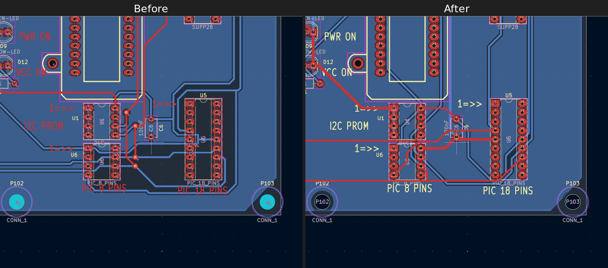

There are two ways to fix this:

- **By hand**, with the interactive router (**Route → Route Single Track**),
  for a handful of tracks. Delete the failing track and route it again around
  the pins.
- **With an autorouter**, for many. pic_programmer was rerouted with
  [Freerouting](https://freerouting.app), which reads the net class widths
  and clearances from KiCad:
  1. Delete every track on each net that has an error, so those nets start
     clean. (For pic_programmer that was 9 nets.)
  2. Delete the copper pour for now. Freerouting treats a pour as solid copper
     and won't route through it, so nothing can use that layer.
  3. **File → Export → Specctra DSN…**
  4. Open the `.dsn` in Freerouting, run the autorouter, and save the result
     as a Specctra session (`.ses`) file.
  5. **File → Import → Specctra Session…** to bring the new tracks into
     KiCad.
  6. Redraw the pour, refill it, and run DRC.

Always check autorouted tracks by eye: they're correct, but they don't know
which parts of the board you'd like to keep clear.

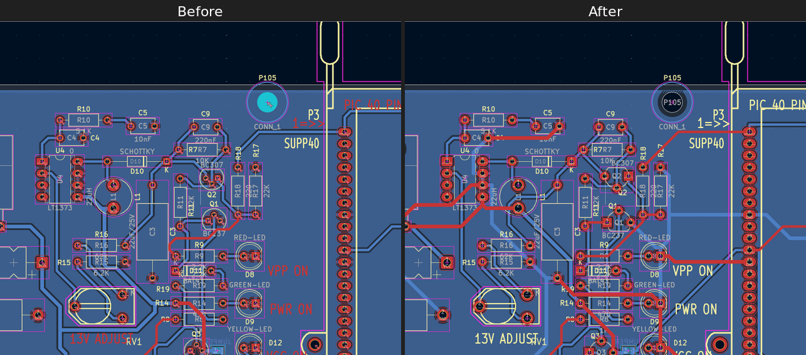

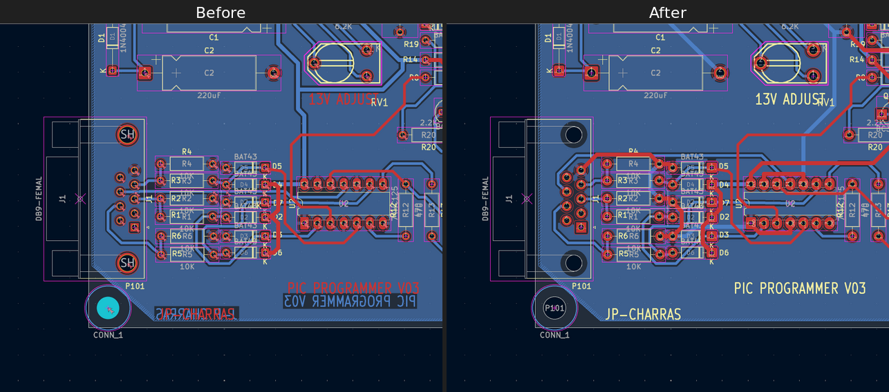

## 13. Step 8: Final DRC

Run DRC again, with **Refill all zones before performing DRC** ticked. The
board is ready when there are no errors and no unconnected items.

| Option A (pads edited on a copy) | Option B (E44 footprint library) |
|---|---|
| 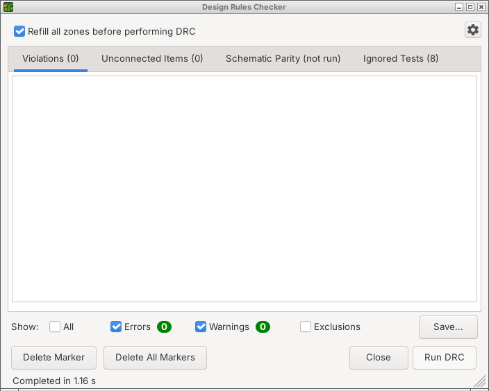 | 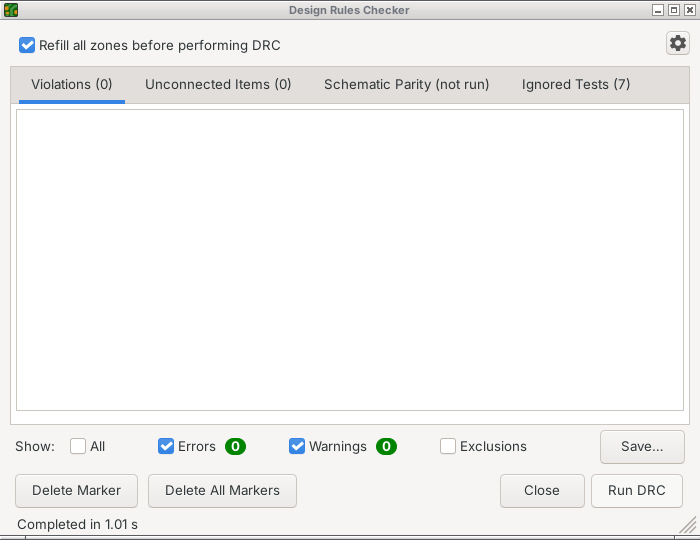 |
| 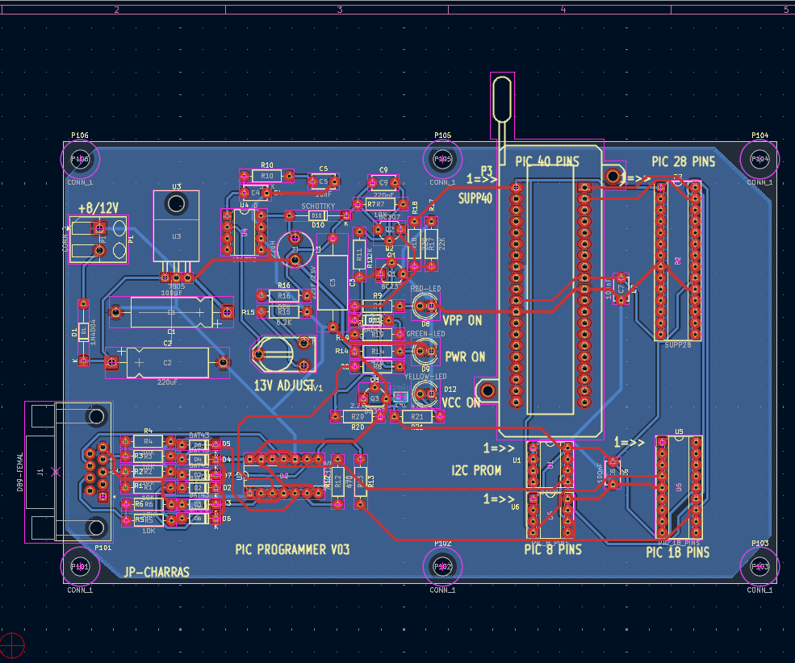 | 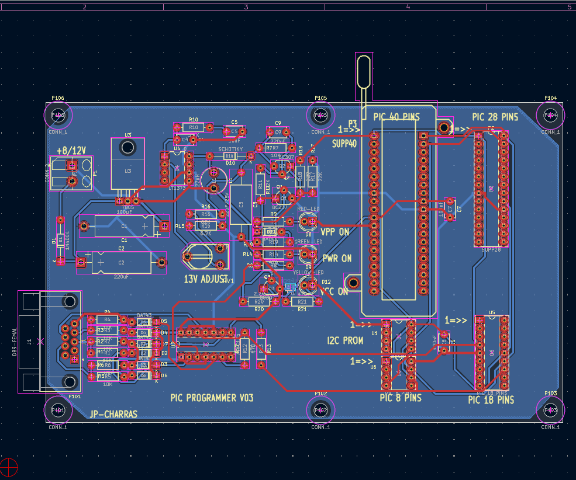 |

The two boards differ in detail (the autorouter made different choices, and
option A keeps each pad's original shape), but both pass every E44 rule.

The copper the E44 will leave behind on the option B board (black is copper):

The copper the E44 will leave behind on each side (black is copper):

| Bottom (B.Cu) | Top (F.Cu) |
|---|---|
| 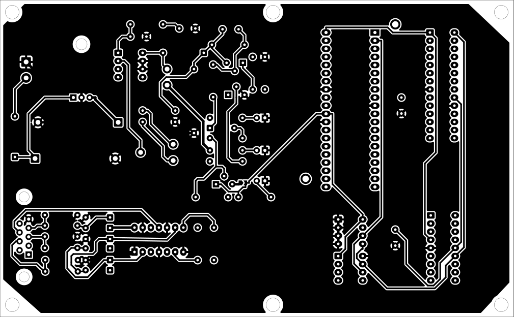 | 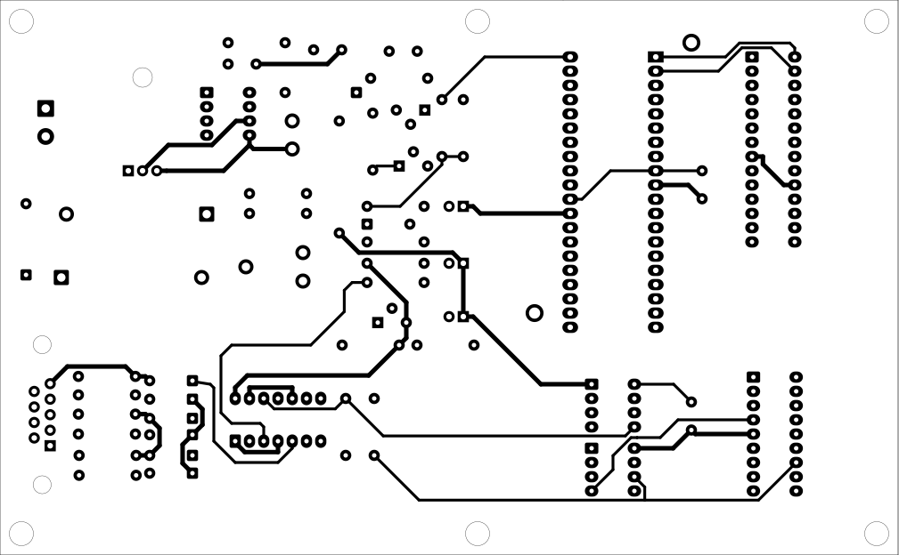 |

## 14. Things DRC won't tell you

- **Holes aren't plated.** On a board-house PCB every hole joins top and
  bottom copper. On the E44 they don't, so:
  - A **via** needs a wire or rivet pushed through and soldered both sides.
    The rerouted pic_programmer uses none.
  - A **top-layer track to a through-hole pad** must be soldered on the top
    side as well. That's easy for a resistor, but hard or impossible under a
    DIP socket, a ZIF socket or a connector body. The adapted pic_programmer
    still has top tracks to its sockets, which are fine for a plated board
    but awkward on the E44.

  **TODO:** document the lab's double-sided practice (rivets, through-plating,
  board flipping and alignment). Until then, prefer single-sided boards, or
  keep top-layer tracks away from pads you can't reach from the top.
- **Copper text width** isn't checked (see [Step 6](#11-step-6-fix-tracks-vias-text-and-pours)).
- **Inside corners** of the board outline and cutouts can't be sharper than
  R0.5, because the router is 1.0 mm. Round them off, or allow for it in
  anything that has to fit.
- **Lead sizes.** The drill table is a starting point. Check the datasheet
  lead size of any part you round down (like the TO-220 here).

## 15. DRC message reference

| DRC message | Cause | Fix |
|---|---|---|
| `E44 clearance 0.35mm` | Copper too close together | Reroute, or shrink pads in the E44 footprint |
| `E44 min track 0.5mm` | Track narrower than 0.5 mm | Select the track, press **E**, set width to 0.5 or more |
| `E44 copper to edge 1.0mm` | Copper within 1.0 mm of Edge.Cuts | Move the part or track inwards, or refill the zone |
| `E44 annular ring 0.6mm` | Pad too small for its hole | Enlarge the pad ([8.2](#82-pad-sizes-and-annular-rings)) |
| `E44 annular ring 0.5mm on 1.0mm holes` | Pad on a 1.0 mm hole smaller than 2.0 mm | Enlarge the pad to 2.0 mm |
| `E44 slot narrower than 1.0mm router` | Oval hole under 1.0 mm wide | Widen the slot |
| `E44 pad drill not in tool set` | Pad hole isn't 0.7/0.8/1.0/1.5/2.0 | Change the hole ([8.1](#81-hole-sizes)), or make it a cutout ([8.3](#83-holes-bigger-than-20-mm)) |
| `E44 via drill not in tool set` | Via hole isn't in the set | Change the via to 1.9 / 0.7 |

## 16. Exporting for CircuitPro

The E44 only needs four files: top copper, bottom copper, the board outline
and the drill file. [`e44.kicad_jobset`](../e44.kicad_jobset) is a KiCad
**jobset** (a saved list of exports) that makes exactly those in one click.
Jobsets need KiCad 9 or later.

### 16.1 Add the jobset to your project

1. Download [`e44.kicad_jobset`](../e44.kicad_jobset) and put it in your
   project folder, next to the `.kicad_pro` file.
2. **Save the board** in the PCB Editor. The jobset exports the board as it
   is saved on disk.
3. In the KiCad **project manager** (the window that lists the project files,
   not the PCB Editor), choose **File → Open Jobset File…** and pick
   `e44.kicad_jobset`.

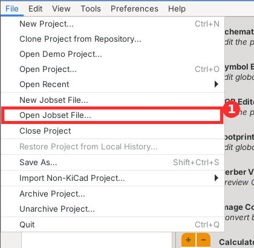

### 16.2 Generate the files

The jobset opens in its own tab. Click **Generate** (1). The files appear in
a new folder in the project called **`<project name> Gerber Files for e44`**
(2), and the blue tick shows it worked. For pic_programmer that's
`pic_programmer Gerber Files for e44`:

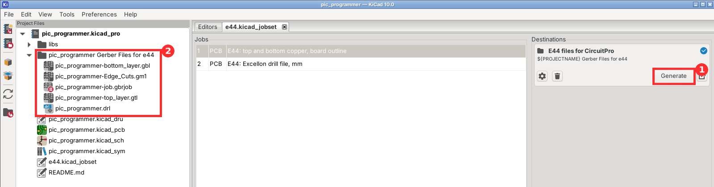

The folder name comes from the project's file name (`pic_programmer.kicad_pro`
→ `pic_programmer`), so each project gets its own clearly named folder. This is
the folder to take to the E44.

| File | What it is | Use in CircuitPro |
|---|---|---|
| `<board>-F_Cu.gtl` | Top copper | Top layer |
| `<board>-B_Cu.gbl` | Bottom copper | Bottom layer |
| `<board>-Edge_Cuts.gm1` | Board outline, plus any cutouts from [8.3](#83-holes-bigger-than-20-mm) | Board outline (contour routing) |
| `<board>.drl` | Excellon drill file, all holes, in mm | Drill |
| `<board>-job.gbrjob` | Gerber job file (a summary for board houses) | Not needed |

If your board has renamed copper layers the file names follow them:
pic_programmer's are `top_layer.gtl` and `bottom_layer.gbl`.

Re-run **Generate** whenever you change the board. It overwrites the old files.

### 16.3 What the jobset is set to

**Output folder:** `${PROJECTNAME} Gerber Files for e44`. `${PROJECTNAME}` is a
KiCad variable that becomes the project name. To change the folder name, click
the gear button on the **E44 files for CircuitPro** destination.

You don't need to change anything, but this is what it does. Double-click a
job in the list to see or change its settings.

**Gerbers:** only **F.Cu**, **B.Cu** and **Edge.Cuts**, with **Refill zones
before plotting** on so a stale copper pour can't be exported. Everything
else is KiCad's default (4.5 format in mm, X2 attributes, Protel extensions).
The jobset names layers by their internal names, so it picks the right layers
even on a board where they've been renamed, and on a 4-layer board it still
exports only the outer two.

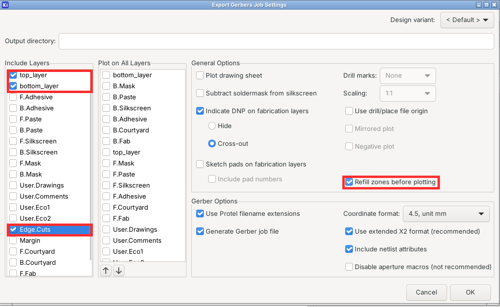

**Drill:** Excellon in **millimetres**, decimal format, absolute origin,
plated and non-plated holes in one file (the E44 doesn't plate holes, so
there's nothing to keep apart).

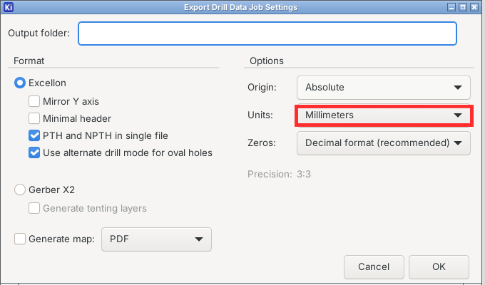

### 16.4 From the command line

The same jobset runs without opening KiCad, which is handy for scripts:

```
kicad-cli jobset run -f e44.kicad_jobset my_board.kicad_pro
```

### 16.5 Still to check at the machine

**TODO:** confirm against CircuitPro on the lab PC:

- that CircuitPro reads the Excellon file in mm without changing its import
  settings, and that the drill sizes come through matching the tool rack;
- how slots (oval holes) import, if a board has any;
- how the lab gets files to the machine.

## 17. Pre-flight checklist

- [ ] E44 custom rules added, and the rule checker says **No errors found**
- [ ] Every net class: clearance ≥ 0.35, track ≥ 0.5, via 1.9 / 0.7
- [ ] Silkscreen and solder mask checks set to Ignore
- [ ] Option A: working on a copy, library-mismatch warnings ignored. Option B: footprints come from the E44 library in both the board and the schematic
- [ ] Every hole is 0.7, 0.8, 1.0, 1.5 or 2.0 mm; larger holes are Edge.Cuts cutouts
- [ ] No SMD parts finer than 0.95 mm pitch
- [ ] No copper text
- [ ] Board outline closed, inside corners R0.5 or larger
- [ ] Ground pour on spare area
- [ ] As few vias and top-side joints as possible
- [ ] DRC: 0 errors, 0 unconnected, schematic parity passes
- [ ] Board saved, then exported with `e44.kicad_jobset` (files in `<project name> Gerber Files for e44`)
